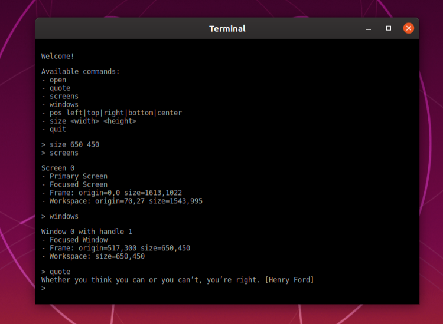

# Audience
A small adaptive cross-platform and cross-technology webview window library to build modern cross-platform user interfaces.

- It is **small**: The size of the Audience runtime is just a fraction of the size of the Electron runtime. Currently, the ratio is about 1%, further optimizations pending.

- It is **compatible**: Currently, we provide ready-to-go APIs for C/C++ and Node.js, but you can plug it into any environment, which supports either C bindings or can talk to Unix sockets respectively named pipes.

- It is **adaptive**: Audience adapts to its environment using the best available webview technology based on a priority list. E.g., on Windows, it can be configured to try embedding of EdgeHTML first and fall back to the embedding of IE11.

- It supports two-way **messaging**: the web app can post messages to the native backend, and the native backend can post messages to the web app.

- It supports web apps provided via a filesystem folder or URL. Audience provides its custom web server and websocket service tightly integrated into the library. But if you prefer a regular http URL schema, you can use Express or any other http based framework you like.

- The core provides a lightweight C API, a command-line interface, as well as a channel-based API (using Unix sockets and named pipes on Windows). Integrations into other environments are provided on top, e.g., for Node.js.

The following screenshots show a simple web app based on [jQuery Terminal](https://terminal.jcubic.pl/).

<table><tr><td></td><td></td></tr><tr><td></td></tr></table>

## Compatibility

Internally the library is split into a shell (shell, as in wrapper, not as in command shell) and multiple nuclei. All nuclei share the same internal API, and each nucleus implements a specific webview technology. The shell probes the available nuclei one after another according to a priority list.

Currently, the following nuclei are implemented:

Platform | Technology | Restrictions
--- | --- | ---
Windows | EdgeHTML (WinRT) | (1)
Windows | MSHTML (OLE) | none
MacOS | WebKit (WKWebView) | none
Unix | WebKit (WebKitGTK) | none

1. EdgeHTML supports directory based provisioning only. It is not possible to serve localhost based web apps to an EdgeHTML based webview. It is meant to be a security feature of the App Container sandbox introduced by Microsoft.

The following nuclei will be implemented soon:

Platform | Technology | Expected Restrictions | Issue #
--- | --- | --- | ---
All Platforms | Chrome App Mode | (1) | [#8][i8]
Unix | QtWebEngine | none | [#14][i14]
Unix | Generic Browser Fallback | (2) | [#1][i1]

[i1]: https://github.com/core-process/audience/issues/1
[i8]: https://github.com/core-process/audience/issues/8
[i14]: https://github.com/core-process/audience/issues/14

1. Chrome App Mode: A custom window menu and icon configuration will be ignored. Use favicon to influence the window icon.
2. Generic Browser Fallback: Window positioning via Audience API will not be possible. A custom window menu and icon configuration will be ignored. Use favicon to influence the window icon.

## Simple Example

### Backend: C API

```c++
int main(int argc, char **argv)
{
  // init audience
  AudienceAppDetails ad{};

  ad.load_order.windows[0] = AUDIENCE_NUCLEUS_WINDOWS_EDGE;
  ad.load_order.windows[1] = AUDIENCE_NUCLEUS_WINDOWS_IE11;
  ad.load_order.macos[0] = AUDIENCE_NUCLEUS_MACOS_WEBKIT;
  ad.load_order.unix[0] = AUDIENCE_NUCLEUS_UNIX_WEBKIT;

  ad.icon_set[0] = L"./icons/16x16.png";
  ad.icon_set[1] = L"./icons/128x128.png";
  ad.icon_set[2] = L"./icons/1024x1024.png";

  AudienceAppEventHandler aeh{};
  if (!audience_init(&ad, &aeh))
    return 1;

  // create and show window
  AudienceWindowDetails wd{};
  wd.webapp_type = AUDIENCE_WEBAPP_TYPE_DIRECTORY;
  wd.webapp_location = L"./webapp";

  AudienceWindowEventHandler weh{};
  weh.on_message.handler = [](AudienceWindowHandle handle, void *context, const wchar_t *message) {
    audience_window_post_message(handle, L"pong");
  };

  if (!audience_window_create(&wd, &weh))
    return 1;

  // launch main loop
  audience_main(); // calls exit by itself
  return 0;        // just for the compiler
}
```

See [here](examples/terminal/) for the complete example.

### Frontend

```html
<!DOCTYPE html>
<html>
<head>
  <meta http-equiv="X-UA-Compatible" content="IE=edge">
  <title>Ping Pong</title>
  <script src="/audience.js"></script>
  <script src="/jquery-3.3.1.min.js"></script>
  <script src="/terminal/js/jquery.terminal.min.js"></script>
  <link rel="stylesheet" type="text/css" href="/terminal/css/jquery.terminal.min.css" />
  <style>
    body {
      margin: 0;
      background-color: black;
    }
  </style>
</head>
<body>
  <div id="terminal"></div>
  <script>
      var terminal = $('#terminal').terminal(function (command) {
        audience.postMessage(command);
      });
      audience.onMessage(function (message) {
        terminal.echo(message);
      });
  </script>
</body>
</html>
```

See [here](examples/terminal/) for the complete example.

## API

### Backend: Command Line Interface

```sh
$ ./audience
Usage:
  audience [OPTION...]

      --win arg      Nucleus load order for Windows; supported: edge, ie11
                     (default: edge,ie11)
      --mac arg      Nucleus load order for macOS; supported: webkit
                     (default: webkit)
      --unix arg     Nucleus load order for Unix; supported: webkit (default:
                     webkit)
  -i, --icons arg    Icon set
  -d, --dir arg      Web app directory; local file system path
  -u, --url arg      Web app URL
  -t, --title arg    Loading title
  -p, --pos arg      Position of window
  -s, --size arg     Size of window
      --decorated    Decorated window; use =false for undecorated window
      --resizable    Resizable window; use =false for non-resizable window
      --top          Window should stay on top always
      --dev          Developer mode; if supported by web view
  -c, --channel arg  Command and event channel; a named pipe
  -h, --help         Print help
```

### Backend: C API

```c
bool audience_init(const AudienceAppDetails *details, const AudienceAppEventHandler *event_handler);

AudienceScreenList audience_screen_list();

AudienceWindowList audience_window_list();

AudienceWindowHandle audience_window_create(const AudienceWindowDetails *details, const AudienceWindowEventHandler *event_handler);

void audience_window_update_position(AudienceWindowHandle handle, AudienceRect position);

void audience_window_post_message(AudienceWindowHandle handle, const wchar_t *message);

void audience_window_destroy(AudienceWindowHandle handle);

void audience_quit();

void audience_main(); // will not return
```

See [audience_details.h](include/audience_details.h) for a specification of the data types used above.

**Events**: Audience emits process level and window level events. Use `audience_init` to register process level events and `audience_window_create` to register window level events.

| Level | Name | Signature |
| --- | --- | --- |
| Process | quit | ``void (*handler)(void *context)``|
| Window | message | ``void (*handler)(AudienceWindowHandle handle, void *context, const wchar_t *message)``|
| Window | close_intent | ``void (*handler)(AudienceWindowHandle handle, void *context)``|
| Window | close | ``void (*handler)(AudienceWindowHandle handle, void *context, bool is_last_window)``|

**Multithreading**: `audience_init` and `audience_main` need to be called from the main thread of the process. All other methods can be called from any arbitrary thread. They will be dispatched to the main thread automatically. Event handlers will be called on the main thread always. Be aware: of course, you can call the Audience API within event handlers. But you should not block-wait for another thread within an event handler, which in return utilizes the Audience API. This will lead to a deadlock scenario.

### Backend: Node.js API, based on channel API

```ts
function audience(options?: AudienceOptions): Promise<AudienceApi>;

interface AudienceApi {
  // Commands
  screenList(): Promise<AudienceScreenList>;
  windowList(): Promise<AudienceWindowList>;
  windowCreate(details: AudienceWindowDetails): Promise<AudienceWindowHandle>;
  windowUpdatePosition(handle: AudienceWindowHandle, position: AudienceRect): Promise<void>;
  windowPostMessage(handle: AudienceWindowHandle, message: string): Promise<void>;
  windowDestroy(handle: AudienceWindowHandle): Promise<void>;
  quit(): Promise<void>;
  // Events
  onWindowMessage(callback: _EventCallbackWindowMessage): void;
  onWindowCloseIntent(callback: _EventCallbackWindowCloseIntent): void;
  onWindowClose(callback: _EventCallbackWindowClose): void;
  onAppQuit(callback: _EventCallbackAppQuit): void;
  off(callback?: _EventCallbackAny): void;
  futureExit(): Promise<void>;
};
```

See [index.ts](integrations/backend/nodejs/index.ts) for a specification of the data types used above.

You can install the backend integration library via `npm install audience-backend --save` and import via `import { audience } from 'audience-backend';`.

### Frontend: Web App

```js
window.audience.postMessage(message /* string */)

window.audience.onMessage(handler /* function(string) */)

window.audience.offMessage(handler /* function(string) or undefined */)
```

You can install the frontend integration library via `npm install audience-frontend --save` and import via `import "audience-frontend";`.

Alternatively, you can load the library via ``<script src="/audience.js"></script>``. Path `/audience.js` is a virtual file provided by the backend.

## Build and Binaries

### Pre-built Binaries

Pre-built binaries for a Windows, macOS and Linux are available via [GitHub Releases](https://github.com/core-process/audience/releases). Please download the `release-minsize` (=`MinSizeRel`) variant for production builds. Pre-packed runtime binaries are provided as well. Use `runtime-cli` when you integrate Audience via command line or channel API. Use `runtime-dynamic` in case you use the C API and link the shared library. Use `runtime-static`in case you link the static library.

### Requirements

- CMake 3.15 or newer
- Node.js v10 or newer
- **Windows**: Visual Studio 2019 / MSVC
- **MacOS**: XCode / Clang
- **Unix**: GCC and make

### Windows

```bat
git clone https://github.com/core-process/audience
cd audience
.\build.bat MinSizeRel
```

- The build output will be placed in `<audience>\dist\MinSizeRel`.
- Add the `include` directory to your include paths and link `audience_shared.lib` or `audience_static.lib`.
- Define `AUDIENCE_STATIC_LIBRARY` before including `<audience.h>` in case you want to link the static library.
- All `audience_windows_*.dll` files need to reside next to your executable. The same applies to `audience_shared.dll` in case you linked the shared library.

### MacOS

```sh
git clone https://github.com/core-process/audience
cd audience
./build.sh MinSizeRel
```

- The build output will be placed in `<audience>/dist/MinSizeRel`.
- Add the `include` directory to your include paths and link `libaudience_shared.dylib` or `libaudience_static.a`.
- Define `AUDIENCE_STATIC_LIBRARY` before including `<audience.h>` in case you want to link the static library.
- All `audience_macos_*.dylib` files need to reside next to your executable. The same applies to `libaudience_shared.dylib` in case you linked the shared library.

### Unix

```sh
git clone https://github.com/core-process/audience
cd audience
./build.sh MinSizeRel
```

- The build output will be placed in `<audience>/dist/MinSizeRel`.
- Add the `include` directory to your include paths and link `libaudience_shared.so` or `libaudience_static.a`.
- Define `AUDIENCE_STATIC_LIBRARY` before including `<audience.h>` in case you want to link the static library.
- All `audience_unix_*.so` files need to reside next to your executable. The same applies to `libaudience_shared.so` in case you linked the shared library.
