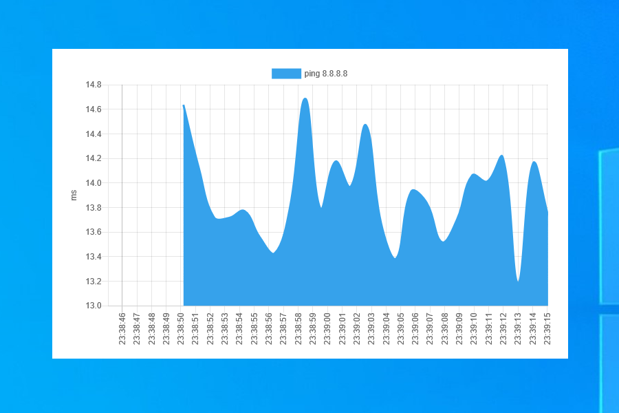

# Audience Ping Example

How to build the example:

```sh
cd <EXAMPLE>/backend
export AUDIENCE_VERSION=x.x.x # pick latest version number from https://github.com/core-process/audience/releases, e.g. 1.0.0
export USE_STATIC_CRT=OFF
export USE_STATIC_AUDIENCE_LIBRARY=ON
export USE_AUDIENCE_DEBUG=OFF
./build.sh MinSizeRel

cd <EXAMPLE>/webapp
npm install
npm run build
```

How to run the example:

```sh
cd <EXAMPLE>
sudo sysctl -w net.ipv4.ping_group_range="0 9999" # Linux only, otherwise ICMP socket cannot be opened
./backend/dist/MinSizeRel/bin/example ./webapp
```

## Screenshots

<table><tr><td></td><td></td></tr><tr><td></td></tr></table>
