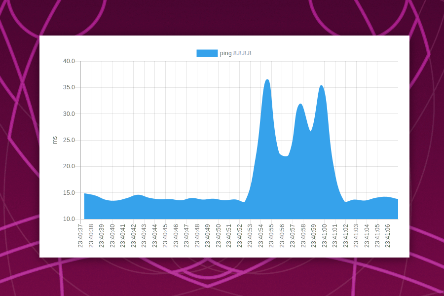

# Audience Ping Example

How to build the example on Windows (`cmd.exe`):

```bat
rem pick latest version number from https://github.com/coreprocess/audience/releases, e.g. 1.0.0
cd <EXAMPLE>\backend
set AUDIENCE_VERSION=x.x.x
set USE_STATIC_CRT=OFF
set USE_STATIC_AUDIENCE_LIBRARY=ON
set USE_AUDIENCE_DEBUG=OFF
.\build.bat MinSizeRel

cd <EXAMPLE>\webapp
npm install
npm run build
```

How to build the example on macOS and Linux:

```sh
# pick latest version number from https://github.com/coreprocess/audience/releases, e.g. 1.0.0
cd <EXAMPLE>/backend
export AUDIENCE_VERSION=x.x.x
export USE_STATIC_CRT=OFF
export USE_STATIC_AUDIENCE_LIBRARY=ON
export USE_AUDIENCE_DEBUG=OFF
./build.sh MinSizeRel

cd <EXAMPLE>/webapp
npm install
npm run build
```

How to run the example on Windows (`cmd.exe`):

```bat
cd <EXAMPLE>
.\backend\dist\MinSizeRel\bin\example .\webapp
```

How to run the example on macOS:

```sh
cd <EXAMPLE>
./backend/dist/MinSizeRel/bin/example ./webapp
```

How to run the example on Linux:

```sh
cd <EXAMPLE>
# The following is required for this ping demo, otherwise the ICMP socket cannot be opened.
# Note: This is NOT a requirement of Audience, it is just this ping demo, which wants
#       to send some ICMP ECHO packages over the network to 8.8.8.8. See ping.cpp.
sudo sysctl -w net.ipv4.ping_group_range="0 9999"
./backend/dist/MinSizeRel/bin/example ./webapp
```

## Screenshots

<table><tr><td></td><td></td></tr><tr><td></td></tr></table>
