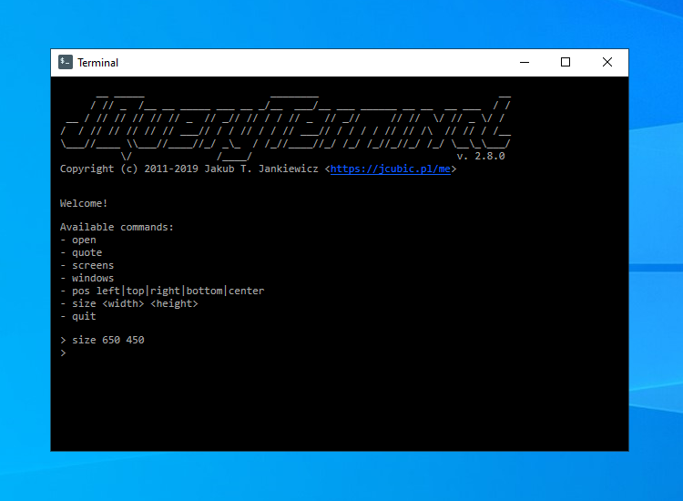

# Audience Terminal Example

How to run the example:

```sh
cd backend
npm install
npm start
```

## Screenshots

<table><tr><td></td><td></td></tr><tr><td></td></tr></table>

## Credits

> "[Paper Icons](http://snwh.org/paper/icons)" by [Sam Hewitt](http://samuelhewitt.com/) is licensed under [CC-SA-4.0](http://creativecommons.org/licenses/by-sa/4.0/)
